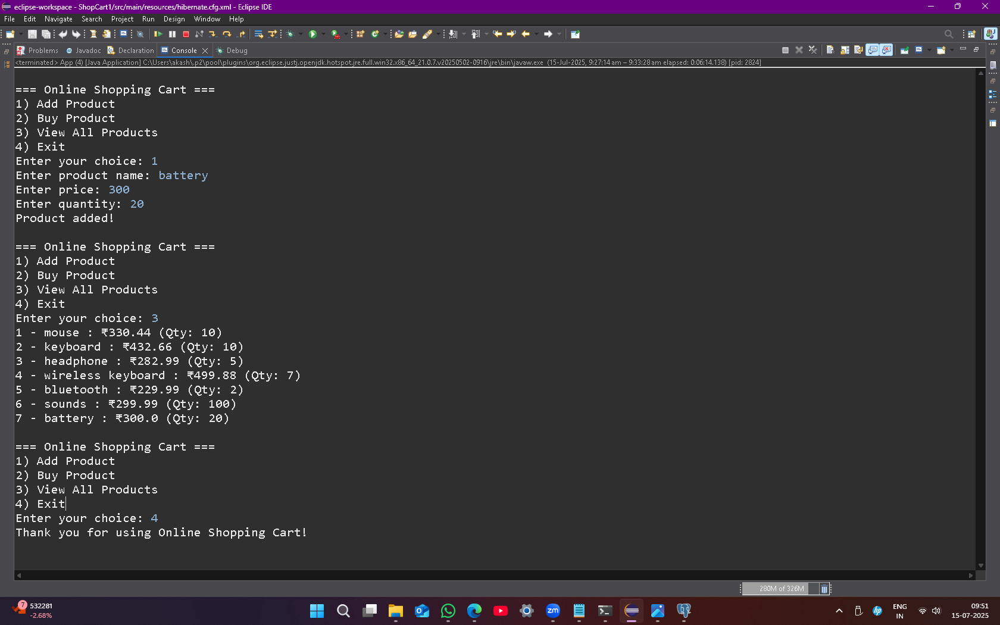

# 🛒 OnlineShoppingCart

- ##  Description

OnlineShoppingCart is a simple Java-based web application that allows users to browse products, add them to a shopping cart, and proceed to checkout. It demonstrates basic CRUD operations, MVC architecture, and database integration using MySQL.

---
## 🚀 Features

- 🔐  User Registration and Login
- 👁️ View Product List
- 🛒 Add Products to Cart
- ✏️ Update/Delete Items in Cart
- 🧰 Buy Products Place orders by selecting product ID and quantity.
- 🔚 Exit
---
 🛠️ Technologies Used

     
- 🖥️ **Java** — A powerful, platform-independent programming language.  
- 🌿 **Hibernate ORM** — Framework for mapping Java objects to database tables.  
- 📦 **Jakarta Persistence API** — API for managing relational data in Java applications.  
- 🛢️ **PostgreSQL** — Advanced open-source relational database system.  
- 🧰 **Maven** — Project management and build automation tool.  
- 🖥️ **Eclipse IDE** — Integrated development environment for Java and other languages.                  
---
##  Maven Dependencies

Add the following to your `pom.xml`:

```xml
<dependencies>
    <dependency>
    <groupId>org.hibernate.orm</groupId>
    <artifactId>hibernate-core</artifactId>
    <version>7.0.6.Final</version>
</dependency>

<dependency>
    <groupId>org.postgresql</groupId>
    <artifactId>postgresql</artifactId>
    <version>42.7.7</version>
</dependency>

    <dependency>
        <groupId>jakarta.persistence</groupId>
        <artifactId>jakarta.persistence-api</artifactId>
        <version>3.2.0</version>
    </dependency>
```
---
## 📁 Project Structure

This Java-based project uses Hibernate ORM with a clean layered architecture.

```plaintext
ShopCart1/
│
├── .gitignore
├── .project                  # Eclipse project config
├── .classpath                # Eclipse classpath config
├── .settings/                # Eclipse settings folder
│
├── pom.xml                   # Maven build file (if using Maven)
│
├── src/
│   ├── main/
│   │   ├── java/
│   │   │   └── ShopCart1/
│   │   │       └── ShopCart1/
│   │   │           ├── App.java
│   │   │           ├── HibernateUtil.java
│   │   │           ├── Order.java
│   │   │           ├── OrderDao.java
│   │   │           ├── Product.java
│   │   │           ├── ProductDao.java
│   │   │           └── (other Java classes)
│   │   └── resources/
│   │       ├── hibernate.cfg.xml
│   │       └── log4j.properties
│   │
│   └── test/
│       └── java/
│           └── ShopCart1/
│               └── ShopCart1/
│                   └── AppTest.java
│
├── target/                  
│
├── src/site/site.xml         
│
└── README.md                 
```
---


## Database Table Schema

#Table: `product`  
| Column    | Type               |
|-----------|--------------------|
| id        | int (Primary Key)  |
| name      | varchar            |
| price     | double             |
| quantity  | int                |

---

#Table: `orders`  
| Column      | Type                   |
|-------------|------------------------|
| id          | int (Primary Key)      |
| product_id  | int (FK)               |
| quantity    | int                    |
---
##Output(screenshot)



----

📞 Contact Details  
────────────────────────────  
- 👤 Name   : Bhumi Yuvraj Raut 
- ✉ Email  : bhumiraut5555@gamil.com 
- 🐙 GitHub : BhumiRaut/ShopCart1

